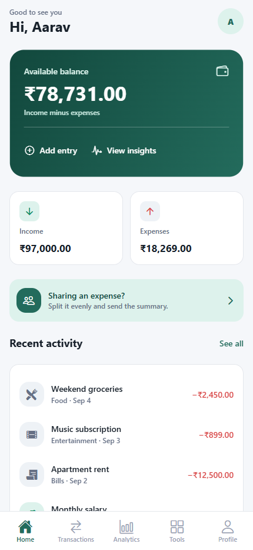
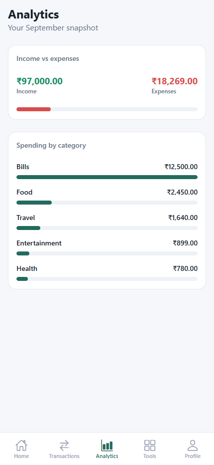
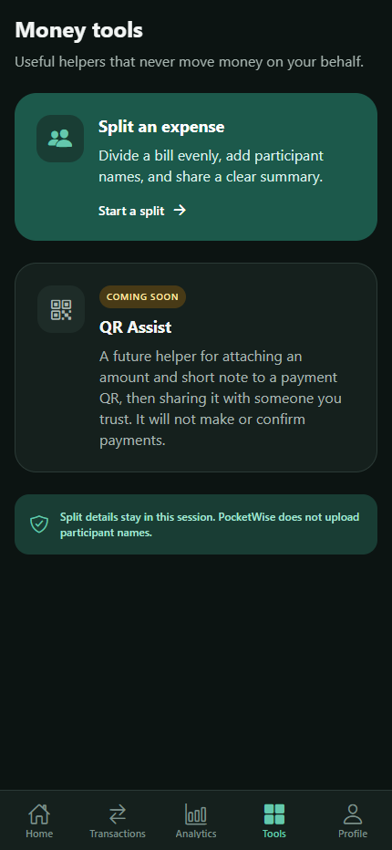
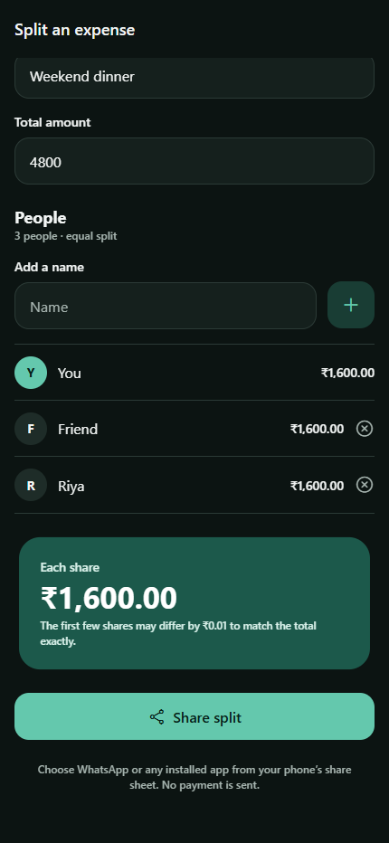

# PocketWise — Personal Finance Tracker

A polished full-stack mobile expense tracker built to demonstrate practical React Native, Expo Router, TypeScript, Express, MongoDB, and JWT authentication.

## Features

- Register, sign in, persisted sessions, protected routes, and secure token storage
- Balance, income, expense, recent-activity, and monthly overview dashboard
- Create, edit, delete, search, filter, and pull-to-refresh transactions
- Category spending and income-vs-expense analytics
- System, light, and dark appearance preferences
- Form validation, loading, empty, API error, and network failure states
- User-scoped backend authorization and production-minded HTTP protections
- Equal expense splitting with exact paise allocation, participant names, and the native share sheet (including WhatsApp when installed)
- Money Tools destination with a privacy-focused QR Assist “Coming soon” preview
- Reduced-motion-aware button feedback and refreshed dashboard visuals

## Architecture

```text
┌────────────────────────┐       HTTPS / JSON       ┌──────────────────────┐       Mongoose       ┌─────────────┐
│ React Native + Expo  │ ◀────── REST API ─────▶ │ Node.js + Express    │ ◀──────────────▶ │   MongoDB   │
│ Expo Router + TS     │                       │ JWT + Zod + bcrypt   │                      │             │
└────────────────────────┘                        └──────────────────────┘                      └─────────────┘
```

The mobile client stores its bearer token in SecureStore and attaches it through an Axios interceptor. Express verifies the JWT and adds its user ID to every transaction query, preventing cross-user access.

## Tech stack

**Mobile:** React Native 0.86, Expo SDK 57, Expo Router 57, React 19.2, TypeScript, Axios, SecureStore, Linear Gradient, AsyncStorage

**Backend:** Node.js, Express 5, TypeScript, MongoDB, Mongoose, Zod, JWT, bcrypt, Helmet
**Quality:** ESLint, strict TypeScript, Node test runner, Metro Android export verification

## Project structure

```text
app/              Expo Router screens and layouts
components/       reusable native UI and transaction components
contexts/         auth, transactions, and theme state
services/         Axios API, authentication, transactions, secure token storage
constants/        design tokens
types/            shared mobile TypeScript contracts
utils/            pure formatting and calculation logic
backend/src/
  config/         validated environment and database setup
  controllers/    HTTP use cases
  middleware/     JWT, 404, and error handling
  models/         Mongoose schemas
  routes/         endpoint maps
  validation/     Zod request schemas
```

## Local setup

Requirements: Node.js 22.13+ (or another SDK 57-supported release), npm, MongoDB, and Expo Go on an Android phone.

```bash
git clone <your-repository-url>
cd <repository-folder>
npm install
cd backend && npm install
```

Copy `backend/.env.example` to `backend/.env`, replace `JWT_SECRET`, and set your MongoDB connection. Copy `.env.example` to `.env` and set `EXPO_PUBLIC_API_URL`.

For a physical phone, use your computer's LAN IP—not `localhost`:

```env
EXPO_PUBLIC_API_URL=http://192.168.1.10:4000/api
```

The phone and computer must be on the same network, and Windows Firewall must allow the backend's port.

## Run locally

Start the API and Expo together from the repository root:

```bash
npm run dev
```

The backend runs as a PowerShell background job while Expo remains interactive in the foreground, so its QR code and keyboard shortcuts remain visible. Press `Ctrl+C` once to stop both processes.

To run them separately, use Terminal 1:

```bash
cd backend
npm run dev
```

Terminal 2, from the repository root:

```bash
npm start
```

Scan the QR code with Expo Go. Android Emulator uses `http://10.0.2.2:4000/api`; a physical device needs `EXPO_PUBLIC_API_URL` as described above.

## API

| Method | Endpoint | Authentication | Purpose |
| --- | --- | --- | --- |
| GET | `/api/health` | No | Service health |
| POST | `/api/auth/register` | No | Create account and token |
| POST | `/api/auth/login` | No | Sign in and token |
| GET | `/api/auth/me` | Bearer | Restore current user |
| GET/POST | `/api/transactions` | Bearer | List/create own transactions |
| GET/PUT/DELETE | `/api/transactions/:id` | Bearer | Read/update/delete own transaction |

## Quality checks

```bash
npx tsc --noEmit
npm run lint
cd backend
npm run typecheck
npm test
npm run build
```

## Android builds

- Expo Go: fastest JavaScript iteration inside Expo's shared native shell.
- Development build: your own debug app with custom native modules.
- APK: directly installable Android package, useful for testers.
- AAB: Play Store upload format; Google Play creates optimized APKs for devices.

After installing EAS CLI and signing into Expo:

```bash
npx eas-cli login
npx eas-cli build:configure
npx eas-cli build --platform android --profile preview
npx eas-cli build --platform android --profile production
```

Nothing in this repository publishes automatically.

## Screenshots

Compact 430 × 932 previews generated from the Expo web renderer with representative showcase data. Native store captures should be regenerated on the target Android device before publishing.

With the API and Expo web preview running, regenerate them with `npm run capture:screenshots`. Set `POCKETWISE_PREVIEW_URL` when Expo is not using port 8081. The script refreshes the dedicated showcase account before capture; never point it at a production API.

| Dashboard | Analytics |
| --- | --- |
|  |  |

| Money tools | Split an expense |
| --- | --- |
|  |  |

## What I learned

React Native native primitives and mobile layout, Expo/Metro development, file-based native navigation, safe areas and keyboard UX, secure persistence, device-to-localhost networking, authenticated REST integration, user-scoped MongoDB CRUD, and Android build preparation.

For a code-guided walkthrough see [LEARNING_GUIDE.md](./LEARNING_GUIDE.md). For security decisions see [SECURITY.md](./SECURITY.md).
